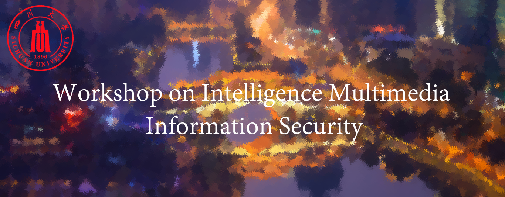

---
organizers:
  -
    name: 罗冰菱
    id: 2021XXXXXX008
  -
    name: 韩松源
    id: 2021XXXXXX029
  -
    name: 夏境鸿
    id: 2021XXXXXX015
title: Workshop on Intelligence Multimedia Information Security
shorttitle: IMIS2022
only-for-homework: true
accept-chinese-submission: true

---

## Call for Papers
With the rapid development of social networks and artificial intelligence, in the context of the epidemic and war, there have been many phenomena of creating fake multimedia information(including images, audios and videos) to spread fake news, posing a huge challenge to multimedia security and cyberspace security. The presence of artificial intelligence makes it easier to tamper multimedia information and the abuse of multimedia information is also emerging in an endless stream. How to protect the security of multimedia information has become a common and important problem faced by mankind. 

Intelligence multimedia information security is the intersection of multimedia intelligent information processing and cyberspace security, which focuses on multimedia encryption and confidential communication, multimedia processing, multimedia steganography and steganalysis, multimedia forensics and watermarking, as well as the application of artificial intelligence on those fields. 

The purpose of this call is to collect papers on intelligence multimedia information security, including latest research, innovative methods, new algorithms and breakthroughs based on previous studies. We cordially invite you to participate in IMIS2022 by submitting your current research results and papers.

## Topics of interest
Topics of interest of IMIS2022 are listed below(but are not limited to). We also encourage authors to combine these topics with artificial intelligence.

- Multimedia encryption
	- Encryption and decryption schemes or algorithms for audios, images or videos
	- Encryption and reliable transmission of multimedia information
	- Biometrics and encryption

- Multimedia information hiding and digital watermarking
	- Steganography and steganalysis in spatial domain or frequency domain
	- Steganography based on Generative Adversarial Networks
	- Copyright protection based on fingerprints or robust digital watermarks
	- Fragile or semi-fragile digital watermarks

- Forensics analyze
	- Multimedia source device identification algorithm
	- Multimedia forensics(copy-move, splicing, remove, etc.)
	- The generation and detection of Deepfake

- Computer vision and multimedia processing
	- Encoding and decoding of multimedia information
	- Audio sampling, compression, synthesis and speech recognition
	- Image filtering, enhancement, compression, segmentation and noise
	- Pattern recognition, object detection, image classification, semantic segmentation

- Artificial intelligence in multimedia
	- The application of deep learning or machine learning algorithms in multimedia
	- Feature extraction and analysis of multimedia information

## Submission Guidelines
### Paper Formats
While writing papers, authors should strictly follow the template provided by IMIS2022. Submitted papers must be original with at least 8 full pages apart from references. All papers should not have been published previously or be reviewed by other conferences at the same time. 
### Review Processes
IMIS2022 will adopt a double-blind review process，which means the reviewer does not know the author of the paper under review and the author does not know the assigned reviewers. So authors must avoid showing personal information in the paper. Each submission will be peer-reviewed by three committee members.
### Review Results
There are three kinds of results after the review part, which are accepted, to be modified and rejected. If the paper is accepted for publication, at least one of the authors should attend this workshop and present research results with slides or pre-recorded videos. If the paper should be modified, authors can revise the paper based on the suggestions written by the experts and then submit it again. The revised paper will be transvalued. Rejected paper can not be submitted again. 

## Important Dates
| * | Schedule | Date |
| :-----| :----| :----: |
| 1 | Special Session & Workshop Proposal | March 25,2022 |
| 2 | Notification of Special Session & Workshop Acceptance | April 25,2022 |
| 3 | Full Paper & Special Session Submission | May 20,2022 |
| 4 | Notification of Paper Acceptance | June 20,2022 |
| 5 | Camera-ready Paper Upload | June 30,2022 |

## Guest Editors
* Bingling Luo (SiChuan University, China)

* Songyuan Han (SiChuan University, China)

* Jinghong Xia (SiChuan University, China)

## Contact
For any questions about paper submissions, please contact us at Email: 10112534@scu.edu.com