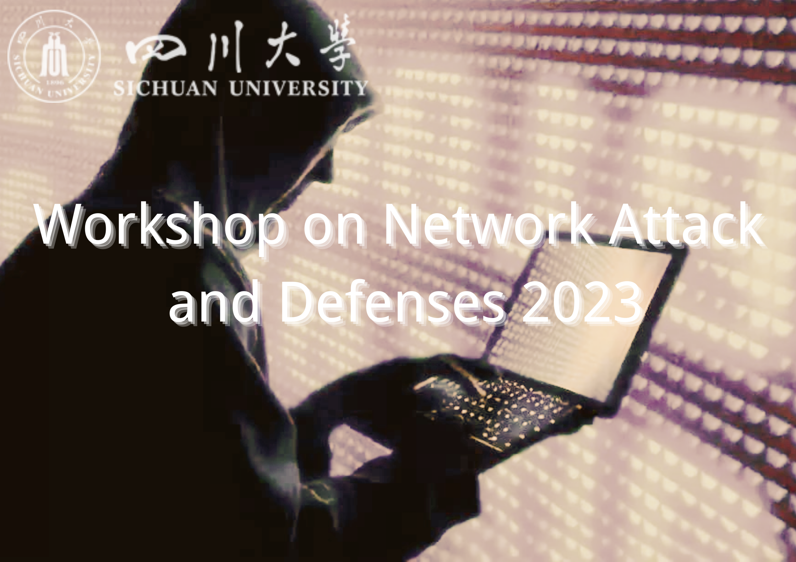

# Call For Papers

## WNAD 2023

_China,Chengdu_
_The 1st Meeting of the Workshop on Network Attack and Defenses
Shuangliu,Chengdu,May 24, 2023_

Network security plays a crucial role in countering cyber threats, and network attack and defense (NAD) is an important means to achieve this. NAD involves using technical means to attack or protect target systems, networks, or data by exploiting vulnerabilities or weaknesses in computer or internet systems. Its development has gone through multiple stages, from technical security in the cold war era to expanding into diverse and complex areas. Today, NAD faces new challenges and opportunities, with the potential for artificial intelligence to be one solution for enhancing network security.
We welcome papers that cover theoretical, empirical, and practical aspects of network security. Submissions should provide novel contributions to the field, including new approaches and  methodologies. 

## Topics of interest

Topics of interest include, but are not limited to:

+ Cloud Security and Privacy

+ Network Security and Cryptography

+ Vulnerability Analysis and Assessment

+ Cyber Threat Intelligence and Analytics

+ Cyber Physical Systems and IoT Security

+ Digital Forensics and Incident Response

+ Network Intrusion Detection and Prevention

+ Blockchain and Distributed Ledger Technologies

+ Cybersecurity Policies, Standards, and Regulations

+ Human Factors and Social Engineering in Cybersecurity

### Submission Guidelines
The workshop aims to facilitate conversations on the current advancements and 
trends in Network Attack and Defenses. The authors  are also invited to submit research papers on related topics that have not been mentioned above. Furthermore, adhering to the WNAD 2023 Paper Submission Guidelines is mandatory for all submissions.

+ **Article Content:** The article should focus on the subject of network attack and defense and explore the new trends and technological developments in this field. The article should be both academic and practical, containing clear views and research conclusions.
+ **Evaluation Rules:** To ensure objectivity and fairness in the review process, this conference adopts a double-blind review approach, where authors and reviewers remain anonymous to each other to protect the privacy of both parties. Authors are requested not to reveal any identifying information in their papers.
+ **Paper Format:** Please submit your paper in PDF format using LaTeX and double-column ACM format(available at [https://www.acm.org/publications/proceedings-template](https://www.acm.org/publications/proceedings-template)). The paper should have 10 references at least. Please ensure that the references are relevant to the theme and content of your paper, and have been certified by authoritative academic institutions or publishers.
+ **Language:** Papers should be written in English and proofread by professionals for language and grammar. We encourage authors to use clear and concise language, and ensure that the text body is complete and self-contained. 
+ **Originality:** The author is required to ensure the originality of the submitted manuscript and that it is free from plagiarism issues. If any copyright dispute arises later, the author voluntarily accepts any corresponding consequences.
+ **Number of Keywords:** Between 5~8 keywords for each paper.

### Important Dates

- Paper submissions due: May 24, 2023
- Final notification to authors: June 3, 2023
- Publication: June 19 - 25, 2023

## Organizers

- **Organizer**: International Cyber Security Symposium
- **Hosts**: Sichuan University, School of Cyber Science and Engineering

- **General Chairs**:

  - Zhou Pengju,Sichuan University,2022xxxxxx001.scu.edu.cn

  - Dai Wanying,Sichuan University,2022xxxxxx003.scu.edu.cn

  - Wang Zhan,Sichuan University,2022xxxxxx006.scu.edu.cn

### Contact Information

Please send your paper to xxxxx@wnad.com